# 🐮 BAKO AI: Foot-and-Mouth Disease (FMD) Detection System

This project contains a production-ready, multi-task deep learning pipeline designed to detect cattle and diagnose Foot-and-Mouth Disease (FMD) from field images. The system is optimized for mobile deployment in rural Uganda.

## 🌟 Project Overview
The model implements a dual-head architecture:
1.  **Gatekeeper Task**: Binary classification (Cattle vs. Non-Cattle). It automatically rejects images of humans, documents, text, or other animals.
2.  **Diagnostic Task**: Binary classification (Healthy vs. Infected). Only active if cattle are detected.

### Key Performance Achieved:
*   **Gatekeeper Accuracy**: **99.7%** (Perfectly filters out non-cattle images).
*   **Diagnostic F1 Score**: **85.4%** (Robust disease detection).
*   **Model Size**: ~2-3 MB after optimization.

### 🏗️ Model Architecture Flow
This model uses a **MobileNetV3-Small** backbone with an integrated **CBAM Attention** block for high-precision feature refinement.

```mermaid
graph LR
    subgraph "Input Layer"
        IMG["📷 Input RGB Image<br>(224 x 224 x 3)"]
    end

    subgraph "Feature Extraction (MobileNetV3)"
        CONV["Conv1 / BNeck Blocks<br>(Inverted Residuals)"]
        FMAX["Deeper Feature Map<br>(576 channels)"]
        IMG --> CONV
        CONV --> FMAX
    end

    subgraph "Attention Optimization (CBAM)"
        CHA["Channel Attention<br>(Refine 'What')"]
        SPA["Spatial Attention<br>(Refine 'Where')"]
        FMAX --> CHA
        CHA --> SPA
    end

    subgraph "Decision Module"
        POOL["Global Adaptive Pool"]
        SPA --> POOL
        
        HEADS["Multi-Task Flow"]
        POOL --> HEADS
        
        GK["<b>Gatekeeper Head</b><br>(Cattle vs. Non-Cattle)"]
        DX["<b>Diagnostic Head</b><br>(Healthy vs. Infected)"]
        
        HEADS --> GK
        HEADS --> DX
        
        GK -- "<i>Activate if Confidence > 85%</i>" --> DX
    end

    subgraph "Final Output"
        RES["Diagnosis Result &<br>Explainability Heatmap"]
        DX --> RES
    end

    style GK fill:#f9f,stroke:#333,stroke-width:2px
    style DX fill:#9f9,stroke:#333,stroke-width:2px
    style CBAM fill:#fff,stroke:#333,stroke-dasharray: 5 5
```



---

## 🏗️ Technical Architecture Details

### 1. Backbone: MobileNetV3-Small
We use MobileNetV3-Small as the feature extractor for its extremely low latency on mobile devices.

### 2. Attention Module: CBAM
We injected a **Convolutional Block Attention Module (CBAM)** to enhance the model's ability to focus on specific spatial features (like lesions on the mouth or hooves) and important channel features.

### 3. Multi-Task Heads
The model branches into two specialized fully connected heads:
*   `gatekeeper_head`: Triage.
*   `diagnostic_head`: Disease detection.

---

## 📈 Training Strategy

### 1. Three-Phase Training
*   **Phase 1**: Frozen backbone. Fine-tune heads only.
*   **Phase 2**: Partially unfreeze deeper backbone layers.
*   **Phase 3**: Full fine-tuning with a very low learning rate (1e-4) for maximum precision.

### 2. Focal Loss
To solve the **class imbalance** (more healthy cattle than infected cattle), we implemented **Focal Loss** for the diagnostic head. This forces the model to work harder on "hard" infected samples.

### 3. Farm-Level Stratified Splitting
Data is split by **Farm ID**, not just by image. This prevents "data leakage" (ensuring the model doesn't just memorize specific cows from the training set).

---

## 🛠️ Included Tools & Scripts

### 1. [train_fmd.py](train_fmd.py)
The master training script. It handles data cataloging (including text images), training, and standard ONNX export.

### 2. [fmd_tools.py](fmd_tools.py) (Deployment Suite)
This script provides the optimization and proof-of-concept features:
*   **L1 Unstructured Pruning**: Removes 30% of unnecessary neural connections to reduce size.
*   **INT8 Dynamic Quantization**: Converts 32-bit weights to 8-bit integers for 4x smaller size and 2x faster mobile inference.
*   **Batch Prediction**: Run logic on multiple images at once.

### 3. [fmd_ui.py](fmd_ui.py) (Testing Interface)
A live **Gradio Web UI** that allows you to:
*   **Imported Model**: Uses the [**best_fmd_model.pth**](fmd_output/best_fmd_model.pth) from the `fmd_output` folder.
*   **Grad-CAM Heatmaps**: Explainability visualizer included.
*   **Diagnostic Summary**: Real-time triage and diagnosis.

---

## 🚀 Deployment Guide

### Running Inference
To run a diagnosis on a single image and save an explainability heatmap:
```bash
python3 fmd_tools.py predict /path/to/image.jpg
```

### Optimizing for Mobile
To generate a compressed model for the mobile app:
```bash
python3 fmd_tools.py optimize fmd_output/best_fmd_model.pth
```

### Launching the UI
To start the interactive testing dashboard:
```bash
python3 fmd_ui.py
```

---

## 📂 File Structure
*   `fmd_output/best_fmd_model.pth`: Final high-precision weights.
*   `fmd_output/fmd_multitask.onnx`: Mobile-ready model.
*   `fmd_output/training_history.png`: Accuracy/F1 progress graphs.
*   `cattle_healthy/`, `cattle_infected/`: Cattle datasets.
*   `not_cattle_*/`: Negative sample datasets (Animals, Environment, Human, Text).

---
**Developed by BAKO AI Assistant**
