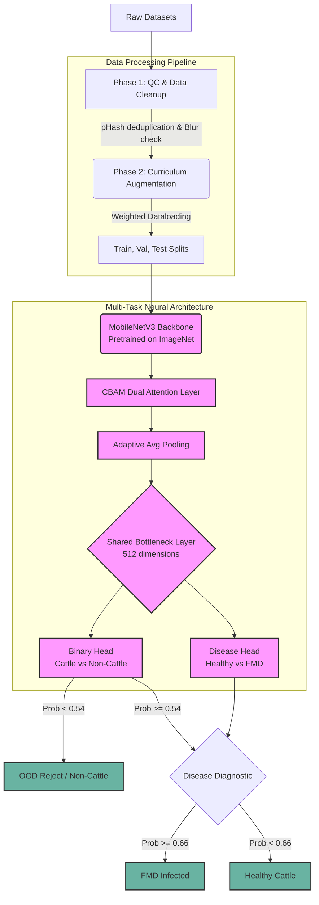

# Foot and Mouth Disease (FMD) Cattle Detection Pipeline: Technical Report

## 1. Executive Summary
Foot and Mouth Disease (FMD) is a highly contagious viral disease affecting cattle worldwide, leading to severe agricultural and economic losses. Early and accurate detection is critical for rapid containment. 

This repository implements an end-to-end, high-performance machine learning pipeline designed to autonomously detect FMD from cattle imagery. Traditional single-task architectures struggle with the high variance in real-world FMD datasets, which often include non-cattle animals or irrelevant backgrounds. To address this, we developed a **Multi-Task MobileNetV3** architecture that jointly classifies:
1. **Binary Task:** Determines if the image contains cattle (filtering out environmental noise, text, and other animals).
2. **Disease Task:** Determines if the cattle is healthy or infected with FMD.

By decoupling the problem into two distinct but shared representational spaces, the pipeline mimics the triage process of a human expert: first confirming the subject, then diagnosing the condition.

---

## 2. System Architecture & Data Flow

The core of this project is a continuous pipeline, beginning from raw folder ingestion and ending with highly optimized, deployment-ready ONNX models.



### Architectural Decisions:
- **MobileNetV3 Backbone:** Chosen for its inverted residual structure and hardware efficiency. The backbone acts as an excellent generic feature extractor that runs comfortably on edge devices while maintaining aggressive accuracy.
- **CBAM (Convolutional Block Attention Module):** FMD indicators (like mouth lesions, excessive salivation, and foot blisters) are localized structural features. The custom CBAM layer forces the network to spatially and channel-wise "pay attention" to these micro-features rather than relying on noisy backgrounds.
- **Shared Bottleneck:** Forces the model to learn a feature representation that is jointly beneficial for identifying cattle anatomy *and* disease pathology, acting as a structural regularizer against overfitting.

---

## 3. Implementation Phases Detailed

The repository follows a strict, modular 6-phase approach implemented in `fmd_pipeline.py`.

### Phase 1: Data Preparation & Quality Control (`cleanup_dataset_dirs`)
Real-world datasets are inherently noisy. During this phase, the pipeline autonomously scans all data roots (`cattle_healthy`, `cattle_infected`, and multiple `not_cattle_*` neg-sets).
- **Perceptual Hashing (pHash):** Extracts a 64-bit hash from every image to find and aggressively remove exact or near-exact duplicates across the dataset, preventing data leakage between the train and test splits.
- **Laplacian Variance:** Images with a variance below the threshold are discarded as blurry. 
- **Computer Vision Heuristics:** Employs OpenCV blobs, edge detection, and HSV color slicing (specifically isolating red lesion ratios and saliva reflections) to dynamically tag "subtle" or "early-stage" FMD cases.

### Phase 2: Curriculum Learning & Data Augmentation (`get_transforms`)
Rather than bombarding the model with heavy augmentations immediately, the transforms are phased:
- **Phase 1 (Epochs 0-5):** Mild augmentations (horizontal flips, slight rotations).
- **Phase 2 (Epochs 5-12):** Moderate augmentations (vertical flips, brightness/contrast shifts).
- **Phase 3 (Epochs 12+):** Aggressive augmentations (Hue/Sat shifts, Gaussian noise, CoarseDropout, Elastic transforms) simulating bad camera qualities.
- **Curriculum Learning:** Utilizing the tags generated in Phase 1, the dataset class dynamically doubles the sample weight for early-stage/subtle FMD images after epoch 10, forcing the model to learn difficult, borderline cases late in training.

### Phase 3: Model Architecture (`MultiTaskMobileNetV3`)
Built purely in PyTorch, leveraging the `torchvision.models.mobilenet_v3_small` architecture, attaching the custom CBAM layer, and splitting into two dense `nn.Sequential` heads.

### Phase 4: Training Strategy & Loss Functions (`train_pipeline`)
- **Focal Loss:** Replaces standard BCE to counteract extreme class imbalance. By down-weighting the easily classified negatives (like the 16,000+ non-cattle images), the model focuses its gradient descent on the hard, sparse FMD examples.
- **Gradual Unfreezing:** 
  - *Phase 1:* Backbone frozen; only the CBAM and Dense Heads learn.
  - *Phase 2:* Last 4 blocks of MobileNetV3 unfrozen with a lower `1e-5` learning rate.
  - *Phase 3:* Full model unfreeze for final fine-tuning.
- **Mixed Precision (AMP):** Utilizes `torch.cuda.amp` to cast operations to `float16` where possible, drastically reducing GPU VRAM usage and accelerating training speed.

### Phase 5: Evaluation & Interpretability
Post-training, the best weights are evaluated against the held-out test fold.
- **Threshold Optimization:** Scans validation probabilities to find the exact classification thresholds (e.g., `0.54` for Binary, `0.66` for Disease) that maximize the harmonic mean (F1-score) rather than assuming a naive `0.5` threshold.
- **Grad-CAM (Gradient-weighted Class Activation Mapping):** Registers backward hooks into the final MobileNetV3 convolutional layer to project a spatial heatmap over test images. This allows veterinary experts to "see what the model sees" (e.g., confirming the model is looking at the hoof, rather than a patch of grass).

### Phase 6: Deployment Optimization (`prune_and_export_model`)
The model is finalized for production environments:
- **L1-Unstructured Pruning:** Prunes 30% of the lowest-magnitude weights in the linear and convolutional heads to enforce sparsity.
- **Exporting:** Traces the computation graph with dummy tensors to export both a `TorchScript` (`.pt`) and a heavily optimized `ONNX` (`.onnx`) artifact for deployment on systems without PyTorch dependencies.

---

## 4. Interactive Components

### Jupyter Notebook (`fmd_training.ipynb`)
For presentation and educational purposes, the entire pipeline is mirrored in an interactive Jupyter Notebook. This allows a technical panel to step through the data preparation, architecture definitions, and evaluation metrics cell-by-cell without needing to parse the entire monolithic python script at once.

### Gradio Web Interface (`fmd_ui.py`)
A fast, local web application built with Gradio. This interface loads the optimized `.pth` weights and exposes a user-friendly drag-and-drop dashboard to test the model dynamically on new images. It prints exact confidence percentages alongside the categorical predictions.

---

## 5. Setup & Execution Instructions

### Installation
Ensure you have Python 3.9+ and an NVIDIA GPU setup.
```bash
# 1. Create and activate virtual environment
python -m venv .venv-gpu
.venv-gpu\Scripts\activate

# 2. Install core PyTorch (assumes CUDA 12.1, adjust if needed)
pip install torch torchvision torchaudio --index-url https://download.pytorch.org/whl/cu121

# 3. Install pipeline dependencies
pip install albumentations opencv-python pandas imagehash gradio seaborn matplotlib tqdm scikit-learn
```

### Running the Full Training Pipeline
To train the model from scratch, clean the data, generate metrics, run Grad-CAM validations, and export the ONNX model:
```bash
python fmd_pipeline.py --data-root /path/to/data --output-dir ./fmd_output
```

### Starting the Web UI
To spin up the interactive tester:
```bash
python fmd_ui.py
# The server will launch at http://127.0.0.1:7860
```
